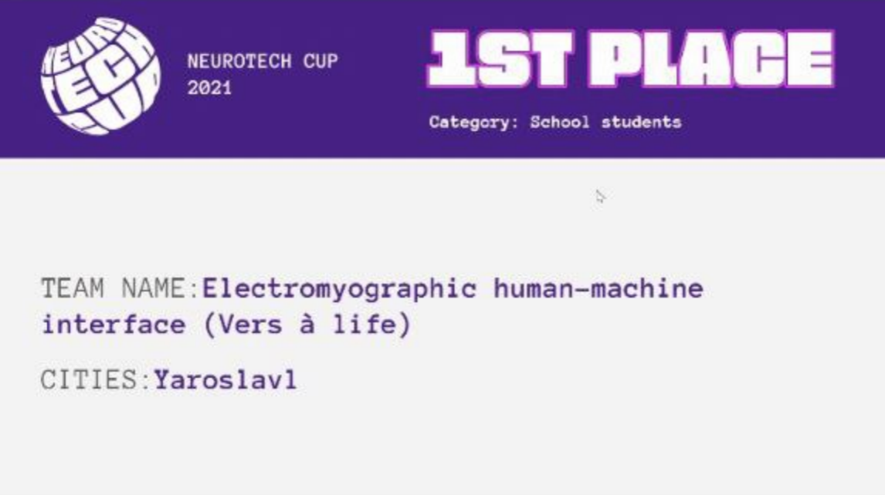

===========
Нейрокурсор
===========

Первый рубеж
============

Наш проект занял первое место среди школьных проектов.

Введение
========

Нейрокурсор — это устройство на базе ATmega32U4, предоставляющее электромиографический человеко-машинный интерфейс для людей с ограниченными возможностями. Разработано в рамках конкурса `Neurotech <https://neurotechcup.com>`_.

Алгоритм
========

Сбор
----

Обработанные с помощью платы EMG данные считываются с порта и попадают в стек.

Фильтрация
----------

Информация из стека фильтруется, усредняется. Также вычисляется `моторная единица <https://wikiless.org/wiki/%D0%9C%D0%BE%D1%82%D0%BE%D1%80%D0%BD%D0%B0%D1%8F_%D0%B5%D0%B4%D0%B8%D0%BD%D0%B8%D1%86%D0%B0?lang=ru>`_ по частоте сигнала.

Обработка
---------

Напряжённость мышцы устанавливается по преодолеванию порога, а направление выбирается в зависимости от напряжённой мышцы и её моторной единицы.                                                                                                                                           
                                                                                                                                             
Действие                                                                                                                                     
--------                                                                                                                                     
                                                                                                                                             
После обработки совершается перемещение мыши в указанном направлении.                                                                        
                                                                                                                                             
Будущее                                                                                                                                      
=======                                                                                                                                      
                                                                                                                                             
Как и в случае с проектом `Stockfish <https://stockfishchess.org/>`_, алгоритм будет вытеснен нейронной сетью, более гибкой и точной. Также на данный момент не оптимальна реализация стэка. Развитие проекта будет продолжаться в основной ветке.                                                                                                          
                                                                                                                                             
Контакты для связи в Telegram                                                                                                                           
=============================                                                                                                         
                                                                                                                                             
Егор Гуслянцев — @egorguslyan  

Иван Зубков — @kyborg_zlodey   

Пётр Орехов — @the_Yoker    

Илья Трейер — @SixSolid
